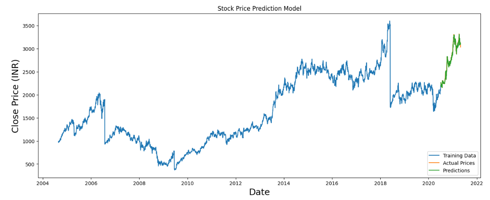
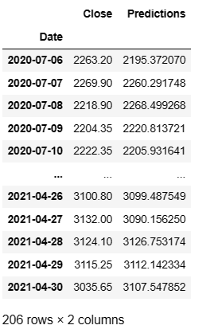
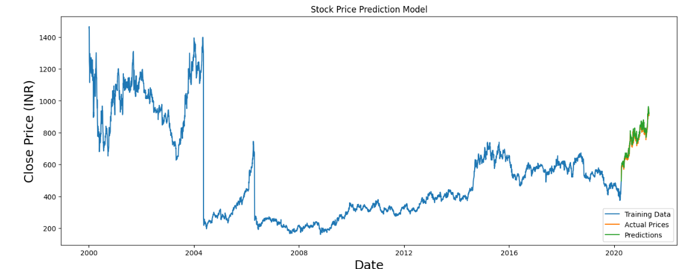
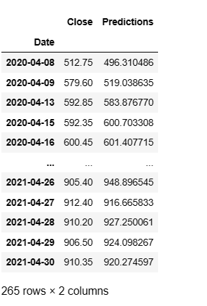

# STOCK-PRICE-PREDICTION-SYSTEM

This project involves building a Long Short-Term Memory (LSTM) neural network to predict stocks closing prices using historical data. The model is implemented using TensorFlow's Keras API.

## Overview

- The dataset used for this project: TCS (Tata Consultancy Services) , CIPLA , ASIANPAINTS , WIPRO , TITAN  stock prices.
- The model predicts stock prices based on historical closing prices.
- LSTM (Long Short-Term Memory) architecture is used for sequence modeling.

## Results
- TCS STOCK CLOSING DAYPRICE PREDICTION GRAPH AND PREDICTION PRICE COMPARED TO STOCK MARKET CLOSING DAY PRICE.

- CIPLA STOCK CLOSING DAY PRICE PREDICTION GRAPH AND PREDICTION PRICE VALUES COMPARED TO STOCK MARKET CLOSING DAY PRICE.

### Model Performance

- The trained LSTM model demonstrates accurate predictions on the TCS and cipla stock dataset.
- The model has been tested on five different datasets i.e TCS (Tata Consultancy Services) , CIPLA , ASIANPAINTS , WIPRO , TITAN  stock prices and it consistently provides good predictions.

